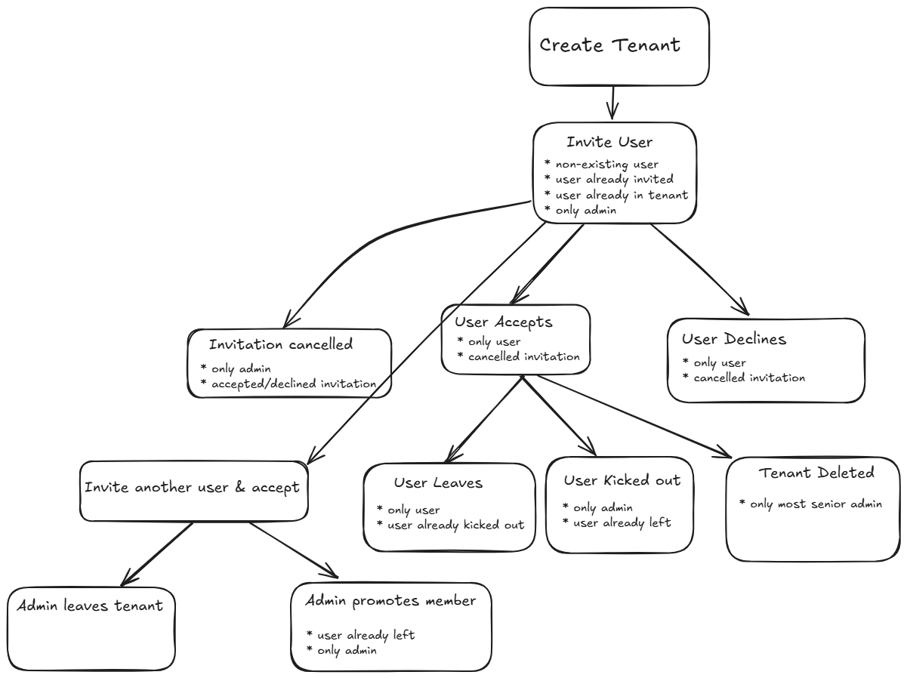

# Multi Tenant App with Google Auth
---

This is a demo application that demonstrates a multi-tenant application where users login with their Google accounts.
It works in a schema-per-tenant strategy. Each tenant has its own schema in MySQL instance, named `tenant_<tenantId>`
There's a central schema `tenant_system` where information about tenants and users reside.

Connecting to a tenant, technically, means setting a Cookie named `tenant` that contains the tenant ID. For each endpoint that is tenant-specific, we
apply the `TenantInterceptor` that reads the cookie, checks if the user has access to the tenant, and processes the request.

We use Spring Security for OAuth2 login. `AutoRegistrationSuccessHandler` is a `AuthenticationSuccessHandler` which automatically 
registers the user in our database once he successfully logs in.

Additionally, we use Spring Security's method security to secure service-level methods (`@PreAuthorize`).

## Tenant management logic
---
A user creates a tenant - which makes him the tenant admin.
The admin (and only him) can invite other users.
The user accepts the invitation and becomes a tenant member.
The admin can promote the member to be an admin.
In the `tenant_user` table there's a column of `admin_since`, and `since` column for regular users.
An older admin can demote a newer admin and remove him, but not vice versa.
If the last admin leaves the tenant, the oldest user in the tenant becomes admin.

## TODO
---
* Implement transactional
* Confirmation prompts for removing user, leaving group and deleting tenant
* Confirmation prompt for logout

