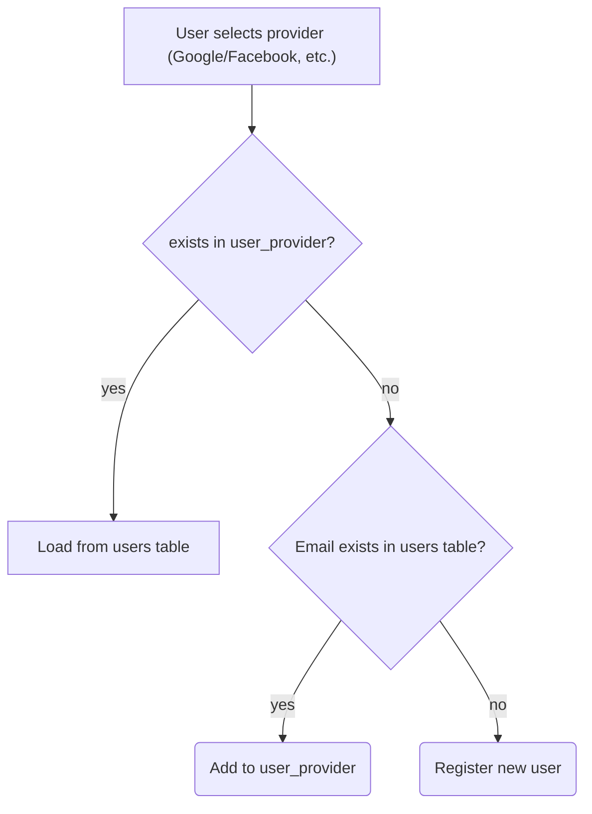

# User Management - Advanced
---

This project is a reference for a mature user management system.
It's an application that allows a user to sign up using OAuth2/OIDC providers, but it has 
a User model of its own, so that the user management can be extended to other methods as well.

## Architecture
See the database structure in the `init.sql` script.

The user can log in using one of OAuth2/OIDC providers.
We have a `users` database table, where we keep user records, where the user ids are application-specific. 
Additionally, we have `user_provider` table where we map provider-specific users to our application users.

Records of `users` table are mapped to `AppUser` model objects.

## Business logic

## Technical details

We provide our own `OidcUserService`, which returns a `SecurityUser` (which implements `OidcUser`). `SecurityUser` holds an `AppUser`. The controller methods can take a `SecurityUser` and read its AppUser.
